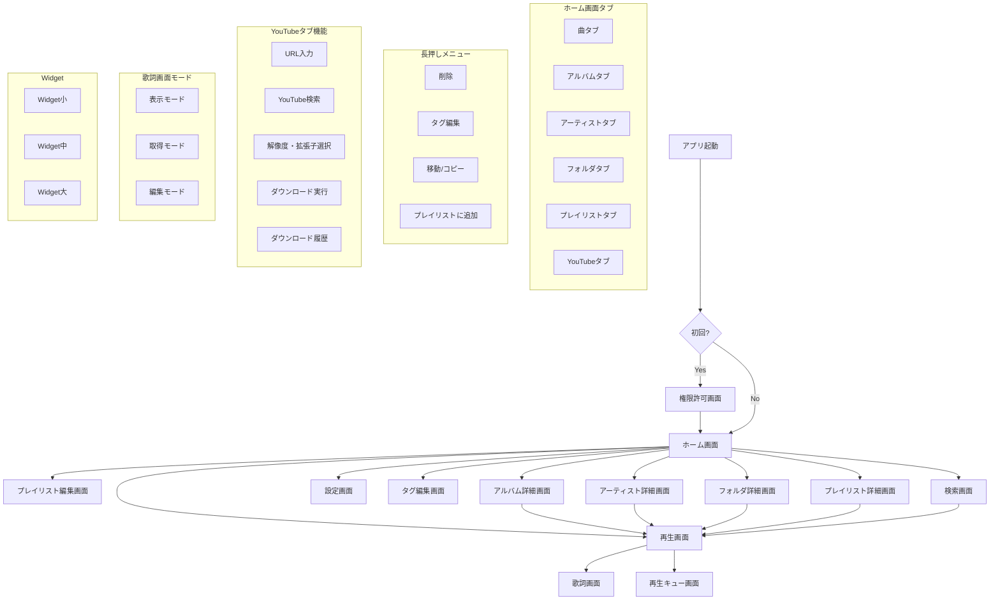

# SoundWave

## 1. 概要

- **サービス説明**: 端末内の音楽を再生するAndroid音楽プレーヤーアプリ。多彩な音声フォーマット対応、音声加工、歌詞機能、YouTube動画ダウンロードなど豊富な機能を搭載
- **ターゲットユーザー**: 一般ユーザー（Google Play公開予定）
- **解決する課題**: 既存アプリの使いにくさを改善したい
- **類似サービス**: Musicolet（シンプル・軽量を参考に）

## 2. ユーザー種別

| 種別 | 説明 |
|------|------|
| 無料ユーザー | 広告あり・全機能利用可能 |
| 有料ユーザー | 広告なし・全機能利用可能 |

## 3. 機能一覧

| カテゴリ | 機能 | 詳細 |
|---------|------|------|
| 再生 | マルチフォーマット対応 | WAV, MP3, MP4, M4A, FLAC, OGG |
| 再生制御 | ループ再生 | 通常ループ |
| 再生制御 | 区間ループ | 指定区間のリピート再生 |
| 再生制御 | シャッフル再生 | ランダム順再生 |
| 音声加工 | 音程変更 | キー変更 |
| 音声加工 | ピッチ変更 | 再生速度変更 |
| 音声加工 | エフェクト追加 | 各種音声エフェクト |
| 歌詞 | 歌詞表示 | 同期歌詞の表示 |
| 歌詞 | 歌詞取得 | LRCLibからの自動取得 |
| 歌詞 | 歌詞編集 | タイムスタンプ編集機能 |
| ダウンロード | YouTube動画DL | 解像度・拡張子指定可能 |
| ファイル | ファイル管理 | 音楽ファイルの整理 |
| ファイル | ファイル検索 | 楽曲検索機能 |
| システム連携 | Widget | ホーム画面ウィジェット |
| システム連携 | メディアコントロール | Android標準メディアコントロール対応 |
| システム連携 | バックグラウンド再生 | アプリ非表示時の継続再生 |
| 設定 | カラーテーマ | テーマカラー変更 |
| 設定 | 多言語対応 | 複数言語サポート |

## 4. 画面一覧

| 画面名 | 対象ユーザー | 概要 |
|--------|------------|------|
| 権限許可画面 | 全ユーザー | 初回起動時、ストレージアクセス等の許可を求める画面 |
| ホーム画面 | 全ユーザー | タブ切り替え式（曲/アルバム/アーティスト/フォルダ/プレイリスト/YouTube） |
| アルバム詳細画面 | 全ユーザー | アルバム内の曲一覧 |
| アーティスト詳細画面 | 全ユーザー | アーティストの曲一覧 |
| フォルダ詳細画面 | 全ユーザー | フォルダ内の曲一覧 |
| プレイリスト詳細画面 | 全ユーザー | プレイリスト内の曲一覧 |
| プレイリスト編集画面 | 全ユーザー | プレイリスト作成・編集画面 |
| 再生画面 | 全ユーザー | 楽曲再生・コントロール画面 |
| 再生キュー画面 | 全ユーザー | 次に再生する曲リスト（再生画面からスワイプ or ボタンで表示） |
| 歌詞画面 | 全ユーザー | 歌詞表示・取得・編集の統合画面（モード切替式） |
| 検索画面 | 全ユーザー | 楽曲検索専用画面 |
| タグ編集画面 | 全ユーザー | 曲情報（タイトル/アーティスト/アルバム/ジャンル/アルバムアート）編集画面 |
| 設定画面 | 全ユーザー | テーマ・言語・課金管理・アプリ情報画面 |
| Widget（小） | 全ユーザー | アルバムアート + 曲名 + 再生/停止ボタン |
| Widget（中） | 全ユーザー | 小サイズ + 前/次ボタン |
| Widget（大） | 全ユーザー | フル表示 |

## 5. 画面フロー

## 6. 各画面詳細

### 権限許可画面
| 項目 | 内容 |
|------|------|
| 画面名 | 権限許可画面 |
| 対象ユーザー | 全ユーザー |
| 概要 | 初回起動時に必要な権限の許可を求める画面 |

| 表示要素 | 詳細 |
|------|------|
| アプリロゴ | SoundWaveのロゴを表示 |
| アプリ名 | SoundWave |
| 権限説明 | ストレージ読取/書込、通知、インターネットの用途説明 |
| 許可ボタン | 権限許可を求めるボタン |

| 操作 | 詳細 |
|------|------|
| 許可ボタンタップ | 各権限のシステムダイアログを表示 |

| 状態 | 詳細 |
|------|------|
| 全権限許可 | ホーム画面へ遷移 |
| 権限拒否 | 再度お願いまたは機能制限の説明を表示 |

| 遷移先 | 条件 |
|------|------|
| ホーム画面 | 全権限許可時 |

---

### ホーム画面
| 項目 | 内容 |
|------|------|
| 画面名 | ホーム画面 |
| 対象ユーザー | 全ユーザー |
| 概要 | アプリ起動時のメイン画面。タブで切り替えて楽曲を閲覧・YouTube機能にアクセス |

| ヘッダー要素 | 詳細 |
|------|------|
| アプリ名/ロゴ | SoundWaveのロゴまたはアプリ名を表示 |
| サイドバーボタン | タップでサイドバーを開く |

| タブ | 内容 |
|------|------|
| 曲 | 全曲一覧 |
| アルバム | アルバム別一覧 |
| アーティスト | アーティスト別一覧 |
| フォルダ | フォルダ別一覧 |
| プレイリスト | 自作プレイリスト一覧 |
| YouTube | URL入力/検索/ダウンロード/履歴 |

| フッター要素 | 詳細 |
|------|------|
| ミニプレーヤー | 再生中は画面下部に表示（アルバムアート、曲名、再生/停止ボタン）、タップで再生画面へ遷移 |

| サイドバー要素 | 詳細 |
|------|------|
| 検索 | 検索画面へ遷移 |
| 設定 | 設定画面へ遷移 |

| 操作 | 詳細 |
|------|------|
| 曲タップ | 再生画面へ遷移・再生開始 |
| 曲長押し | メニュー表示（削除/タグ編集/移動・コピー/プレイリスト追加） |
| 並び替え | タイトル順/アーティスト順/追加日順/再生回数順 |

| 遷移先 | 条件 |
|------|------|
| 再生画面 | 曲タップ時、ミニプレーヤータップ時 |
| アルバム詳細画面 | アルバムタップ時 |
| アーティスト詳細画面 | アーティストタップ時 |
| フォルダ詳細画面 | フォルダタップ時 |
| プレイリスト詳細画面 | プレイリストタップ時 |
| タグ編集画面 | 長押しメニューから「タグ編集」選択時 |
| 検索画面 | サイドバーから「検索」選択時 |
| 設定画面 | サイドバーから「設定」選択時 |

---

### アルバム詳細画面
| 項目 | 内容 |
|------|------|
| 画面名 | アルバム詳細画面 |
| 対象ユーザー | 全ユーザー |
| 概要 | 選択したアルバム内の曲一覧を表示・再生する画面 |

| 表示要素 | 詳細 |
|------|------|
| アルバムアート | アルバムジャケット画像（大きく表示） |
| アルバム名 | アルバムタイトル |
| アーティスト名 | アルバムのアーティスト |
| 曲数 | アルバム内の曲数 |
| 合計再生時間 | アルバム全曲の合計時間 |
| 曲一覧 | アルバム内の曲リスト |
| 全曲再生ボタン | アルバム全曲を順番に再生 |
| 全曲シャッフル再生ボタン | アルバム全曲をシャッフル再生 |

| 操作 | 詳細 |
|------|------|
| 曲タップ | 再生画面へ遷移・再生開始 |
| 曲長押し | メニュー表示（削除/タグ編集/移動・コピー/プレイリスト追加） |
| 全曲再生ボタンタップ | アルバム全曲を先頭から再生開始 |
| 全曲シャッフル再生ボタンタップ | アルバム全曲をシャッフル再生開始 |
| 戻る | ホーム画面へ戻る |

| 遷移先 | 条件 |
|------|------|
| 再生画面 | 曲タップ時、全曲再生時、シャッフル再生時 |
| タグ編集画面 | 長押しメニューから「タグ編集」選択時 |
| ホーム画面 | 戻る操作時 |

---

### アーティスト詳細画面
| 項目 | 内容 |
|------|------|
| 画面名 | アーティスト詳細画面 |
| 対象ユーザー | 全ユーザー |
| 概要 | 選択したアーティストの曲一覧を表示・再生する画面 |

| 表示要素 | 詳細 |
|------|------|
| アーティスト画像 | アーティスト画像（あれば表示） |
| アーティスト名 | アーティスト名 |
| 曲数 | アーティストの曲数 |
| 合計再生時間 | 全曲の合計時間 |
| 曲一覧 | アーティストの曲リスト |
| 全曲再生ボタン | 全曲を順番に再生 |
| 全曲シャッフル再生ボタン | 全曲をシャッフル再生 |

| 操作 | 詳細 |
|------|------|
| 曲タップ | 再生画面へ遷移・再生開始 |
| 曲長押し | メニュー表示（削除/タグ編集/移動・コピー/プレイリスト追加） |
| 全曲再生ボタンタップ | 全曲を先頭から再生開始 |
| 全曲シャッフル再生ボタンタップ | 全曲をシャッフル再生開始 |
| 戻る | ホーム画面へ戻る |

| 遷移先 | 条件 |
|------|------|
| 再生画面 | 曲タップ時、全曲再生時、シャッフル再生時 |
| タグ編集画面 | 長押しメニューから「タグ編集」選択時 |
| ホーム画面 | 戻る操作時 |

## 7. 技術スタック

- **フロントエンド**: Android (Kotlin / Jetpack Compose)
- **バックエンド**: なし（端末内完結）
- **データベース**: Room
- **音声再生**: Media3 (ExoPlayer)
- **音声エフェクト**: 
  - 音程・ピッチ変更: Media3 + SoundTouch
  - イコライザー等: Android標準 AudioEffect API
- **HTTP通信**: Retrofit
- **画像読み込み**: Coil
- **YouTubeダウンロード**: yausername/dvd（yt-dlp Androidラッパー）
- **広告**: AdMob（インタースティシャル広告、バックグラウンド復帰時に表示）
- **課金**: Google Play Billing
- **認証**: なし
- **デプロイ**: Google Play Store
- **開発ツール**: Cursor

## 8. 決定事項・補足情報

- **プロジェクト名**: SoundWave（確定）
- **プラットフォーム**: Android
- **開発言語**: Kotlin
- **UIフレームワーク**: Jetpack Compose
- **開発エディタ**: Cursor
- **対応フォーマット**: WAV, MP3, MP4, M4A, FLAC, OGG
- **歌詞取得元**: LRCLib
- **動画ダウンロード**: YouTube対応（解像度・拡張子指定可能）
- **YouTubeダウンロードライブラリ**: yausername/dvd（yt-dlp Androidラッパー）を使用
- **公開方針**: 一般ユーザー向けにGoogle Playで公開予定
- **開発動機**: 既存アプリをより使いやすくしたい
- **参考アプリ**: Musicolet（シンプル・軽量なUI/UXを参考に）
- **マネタイズ方針**: 無料版（広告あり）と有料版（広告なし）の2種類を提供予定
- **無料版/有料版の機能差**: 機能差なし（広告の有無のみ）
- **課金方法**: サブスク型（月額/年額）
- **課金実装方法**: Google Play Billing
- **アカウント機能**: なし（端末内で完結、課金情報はGoogle Playが管理）
- **ホーム画面構成**: タブ切り替え式（曲/アルバム/アーティスト/フォルダ/プレイリスト/YouTube）
- **ホーム画面ヘッダー**: アプリ名/ロゴを表示
- **ホーム画面ナビゲーション**: サイドバー方式（検索・設定へアクセス）
- **曲一覧の並び替え**: タイトル順/アーティスト順/追加日順/再生回数順
- **ミニプレーヤー**: 再生中は画面下部に表示、タップで再生画面へ遷移
- **プレイリスト機能**: あり（作成・編集可能）
- **再生画面要素**: アルバムアート、曲情報、再生コントロール、ループ、シャッフル、区間ループ、音声加工ボタン、歌詞表示ボタン
- **再生キュー表示方法**: 再生画面からスワイプ or ボタンで表示
- **歌詞画面構成**: 表示・取得・編集を1画面でモード切替する統合画面方式
- **YouTubeタブ機能**: URL入力、YouTube検索、解像度・拡張子選択、ダウンロード実行、ダウンロード履歴表示
- **設定画面項目**: カラーテーマ変更、言語設定、通知設定、デフォルト保存先フォルダ、スキャンフォルダ選択、サブスク購入/管理、アプリ情報、ライセンス情報
- **ファイル検索**: 専用画面を別途作成
- **ファイル管理機能**: 曲の削除、曲情報（タグ）の編集、ファイル移動・コピー、プレイリストへの追加
- **ファイル管理操作**: 曲を長押しでメニュー表示（削除/編集/移動等）
- **タグ編集項目**: タイトル、アーティスト、アルバム、ジャンル、アルバムアート
- **エフェクト表示方法**: 再生画面内で表示切り替え（別画面遷移ではない）
- **エフェクト機能**: イコライザー（低音・高音調整）、リバーブ（残響）、ベースブースト、バーチャライザー（立体音響）
- **初回起動画面**: 権限許可画面（ストレージ読取/書込、通知、インターネット）
- **Widget**: 3サイズ（小/中/大）を用意
- **Widget（小）**: アルバムアート + 曲名 + 再生/停止ボタン
- **Widget（中）**: 小サイズ + 前/次ボタン
- **Widget（大）**: フル表示（アルバムアート大、曲名、アーティスト名、再生コントロール、シークバー）
- **アルバム詳細画面**: アルバムアート（大）、アルバム名、アーティスト名、曲数/合計再生時間、曲一覧、全曲再生ボタン、全曲シャッフル再生ボタン
- **アーティスト詳細画面**: アルバム詳細と同じ構成（アーティスト画像、アーティスト名、曲数/合計時間、曲一覧、全曲再生、シャッフル再生）
- **音声再生ライブラリ**: Media3 (ExoPlayer)
- **データベース**: Room
- **HTTP通信**: Retrofit（LRCLib API連携用）
- **画像読み込み**: Coil（Jetpack Compose対応）
- **広告SDK**: AdMob
- **広告形式**: インタースティシャル広告（全画面）
- **広告表示タイミング**: アプリをバックグラウンドから復帰時
- **音程・ピッチ変更**: Media3 + SoundTouch の組み合わせ
- **イコライザー等エフェクト**: Android標準 AudioEffect API
- **多言語対応**: 日本語、英語、中国語、韓国語（後から追加可能な設計）
- **現在のステータス**: フェーズ5進行中（最低対応Androidバージョンを確認中）